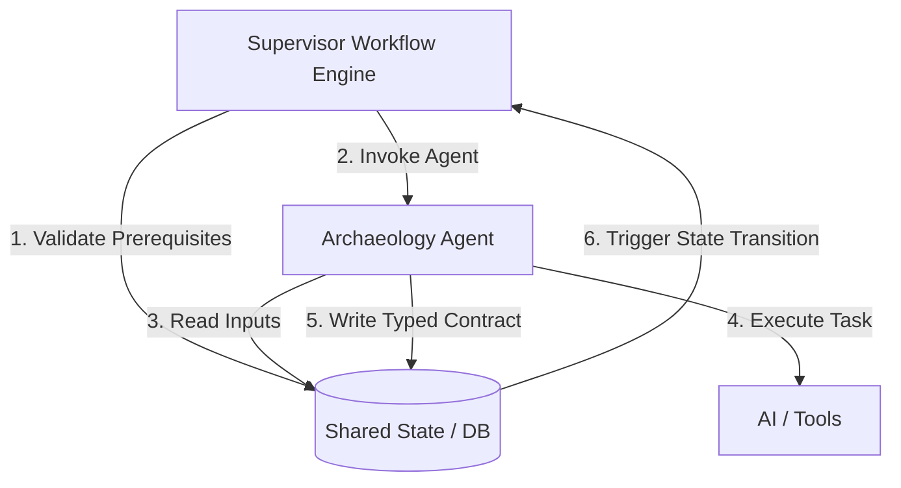
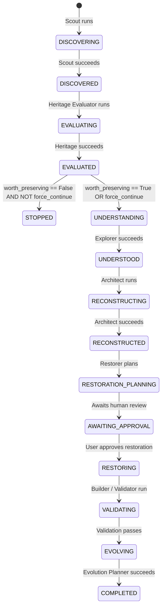
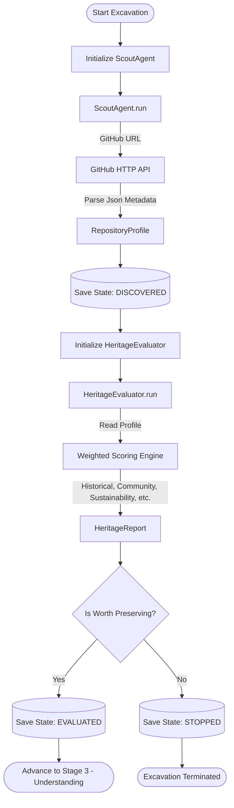
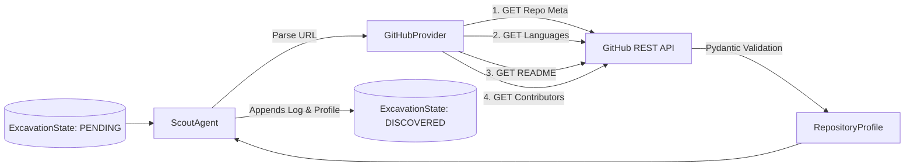
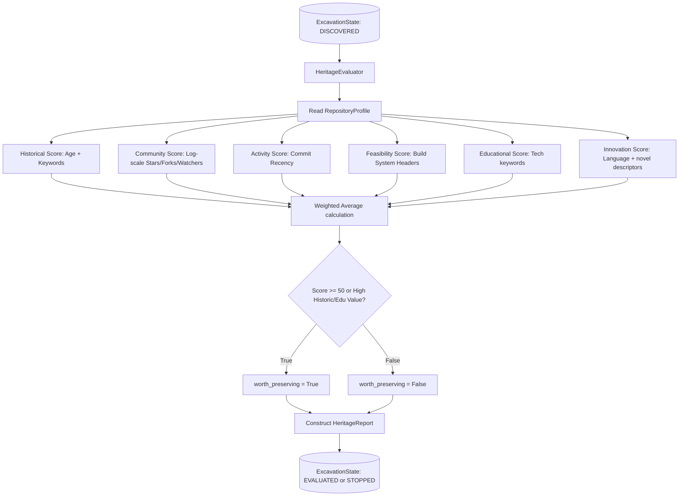
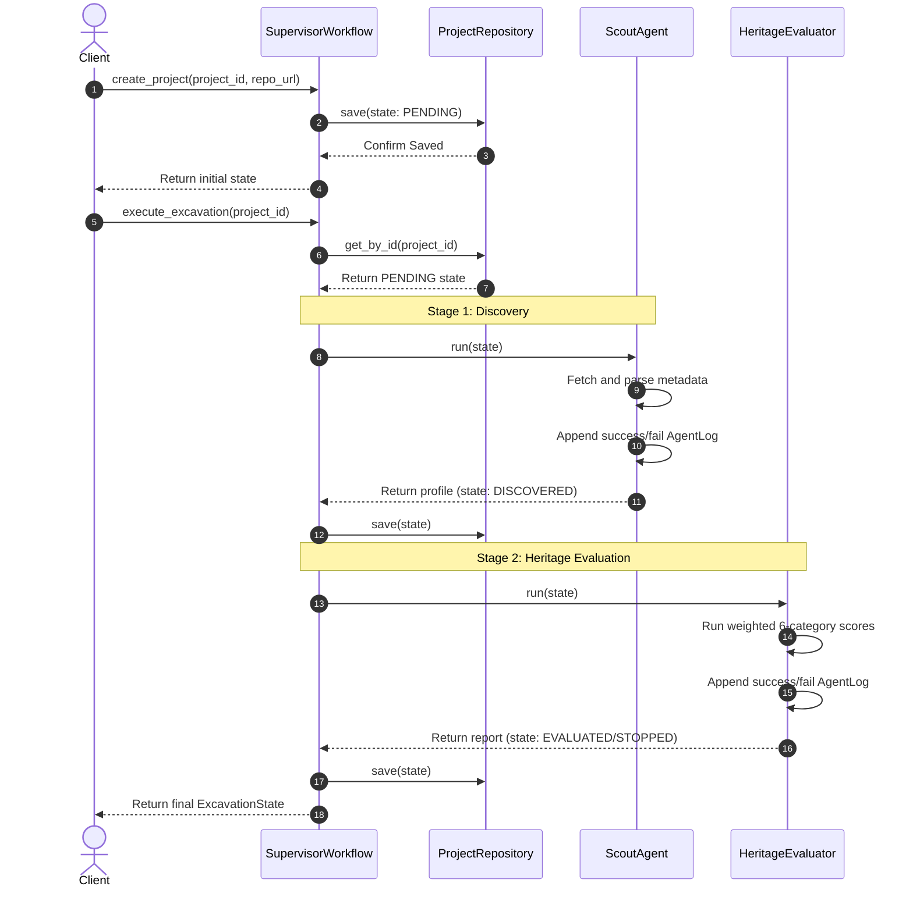

# ReForge Architecture Blueprint

This document details the architectural boundaries, design decisions, and structured agent communication interfaces for the ReForge platform.

---

## 1. Clean Architecture Boundaries

To ensure ReForge is highly maintainable, testable, and explainable, we strictly adhere to Clean Architecture principles. The dependency graph flows **inward** toward the core domain entities:

```text
  ┌──────────────────────────────────────────────────────────┐
  │ Frameworks & Drivers (FastAPI, PostgreSQL, S3)           │
  │   ┌──────────────────────────────────────────────────┐   │
  │   │ Interface Adapters (REST Controllers, DB Repos)  │   │
  │   │   ┌──────────────────────────────────────────┐   │   │
  │   │   │ Use Cases (Supervisor Workflow Engine)   │   │   │
  │   │   │   ┌──────────────────────────────────┐   │   │   │
  │   │   │   │ Domain Entities (Data Contracts) │   │   │   │
  │   │   │   └──────────────────────────────────┘   │   │   │
  │   │   └──────────────────────────────────────────┘   │   │
  │   └──────────────────────────────────────────────────┘   │
  └──────────────────────────────────────────────────────────┘
```

* **Domain Entities (Core):** Framework-agnostic Python classes/dataclasses and Pydantic schemas defining the domain objects (`RepositoryProfile`, `HeritageReport`, `ArchitectureReport`, etc.). No dependencies on databases, AI libraries, or APIs.
* **Use Cases:** Core application logic, including the orchestrator (**Supervisor**) and individual **ArchaeologyAgent** abstract definitions.
* **Interface Adapters:** Translates data between use cases and external tools. Includes REST controllers, agent run execution wrappers, and database repository implementations.
* **Frameworks & Drivers:** Databases, HTTP servers (FastAPI), local/remote storage drivers, and the underlying AI models (LLMs).

---

## 2. The Hybrid Blackboard Pattern

Rather than direct message passing or an unstructured agent chat, ReForge uses a **Hybrid Blackboard Pattern**:

1. **Shared State Store (The Blackboard):** All excavation metadata and generated reports are stored in a central repository, partitioned by `project_id`.
2. **Supervisor Orchestration:** The Supervisor runs as the state machine controller, checking if prerequisites for each stage are met before launching the corresponding agent.
3. **Structured Contracts:** Each agent accepts the current `ExcavationState` and outputs a strongly typed Pydantic contract which updates the state.



---

## 3. Core Domain Data Contracts (Schemas)

We use **Pydantic v2** models to define the input and output boundaries of each stage. Every stage's output must be transparent, typed, and explainable.

### Stage 1: Discovery (`RepositoryProfile`)

```python
from datetime import datetime
from typing import Dict, List, Optional
from pydantic import BaseModel, Field, HttpUrl

class RepositoryProfile(BaseModel):
    """Output of Scout: Basic repository metadata collected without full download."""
    url: HttpUrl
    name: str
    owner: str
    primary_language: str
    languages: Dict[str, float] = Field(default_factory=dict, description="Language percentages")
    stars: int = Field(ge=0)
    forks: int = Field(ge=0)
    watchers: int = Field(ge=0)
    license: Optional[str] = None
    contributors_count: int = Field(default=0, ge=0)
    last_commit_at: datetime
    created_at: datetime
    readme_content: Optional[str] = None
```

### Stage 2: Heritage Evaluation (`HeritageReport`)

```python
class PreservationCategory(BaseModel):
    score: int = Field(ge=0, le=100)
    explanation: str = Field(..., description="Explainable rationale behind the score")

class PreservationProfile(BaseModel):
    historical_value: PreservationCategory
    community_value: PreservationCategory
    activity_sustainability: PreservationCategory
    restoration_feasibility: PreservationCategory
    educational_value: PreservationCategory
    innovation_evolution_potential: PreservationCategory

class HeritageReport(BaseModel):
    """Output of Heritage Evaluator: Multi-dimensional score and rationale."""
    repository_url: HttpUrl
    overall_score: int = Field(ge=0, le=100)
    profile: PreservationProfile
    worth_preserving: bool
    guiding_question_answer: str = Field(
        ..., 
        description="Why does this software deserve another chapter?"
    )
    explanation: str = Field(..., description="Overall summary rationale")
```

---

## 4. Supervisor Workflow State Transitions

The excavation lifecycle is modeled as a state machine managed by the `Supervisor`:



### State Definitions

* **`AWAITING_APPROVAL`:** The pipeline halts when a restoration strategy is planned. Humans retain final authority to modify and approve the code changes before execution.
* **`STOPPED`:** Indicates the software was evaluated as not worth preserving, preventing resource waste.

---

## 5. Agent Flow Diagrams & Process Pipelines

### Overall Process Pipeline (Stages 1 & 2)


### Stage 1: Discovery (Scout Agent) Data Flow


### Stage 2: Heritage Evaluation Data Flow


### Supervisor Orchestration Sequence Flow


---

## 6. Implemented Package Layout

The codebase implements Clean Architecture across these layers:

### Core Domain
* [interfaces.py](file:///c:/Users/vrams/OneDrive/Desktop/ReForge/src/reforge/domain/interfaces.py): Declares abstract `ProjectRepository`, `GitProvider`, and `ArchaeologyAgent` boundaries.
* [models.py](file:///c:/Users/vrams/OneDrive/Desktop/ReForge/src/reforge/domain/models.py): Establishes strongly-typed data validation entities.

### Use Cases (Workflow Executors)
* [scout.py](file:///c:/Users/vrams/OneDrive/Desktop/ReForge/src/reforge/usecases/scout.py): Coordinates discovery pipelines, error transitions, and explainable audit logs.
* [heritage.py](file:///c:/Users/vrams/OneDrive/Desktop/ReForge/src/reforge/usecases/heritage.py): Houses the 6-dimension scoring engine, preserving logic constraints.
* [supervisor.py](file:///c:/Users/vrams/OneDrive/Desktop/ReForge/src/reforge/usecases/supervisor.py): Coordinates the execution order of individual agents, manages state persistence across transitions, and applies validation checkpoints.

### Interface Adapters (Infrastructure Bridges)
* [repositories.py](file:///c:/Users/vrams/OneDrive/Desktop/ReForge/src/reforge/adapters/repositories.py): Outlines storage engines (In-Memory / JSON File).
* [github_provider.py](file:///c:/Users/vrams/OneDrive/Desktop/ReForge/src/reforge/adapters/github_provider.py): Interfaces remote HTTP endpoints, mapping platform data structures to clean domain contracts.


---

## 7. Architectural Principles

1. **Strict Type Safety:** All agents must return instantiated Pydantic models. Any unstructured output or markdown must be wrapped inside a typed property (e.g., `explanation: str`).
2. **Explainability First:** No evaluation score or restoration action can exist without a matching `explanation` property describing the *why*, *how*, and *impact*.
3. **Database Independence:** Interface repositories will hide the actual database (PostgreSQL/JSON) behind abstract interfaces, ensuring the code can run locally using mock repositories during test runs.
